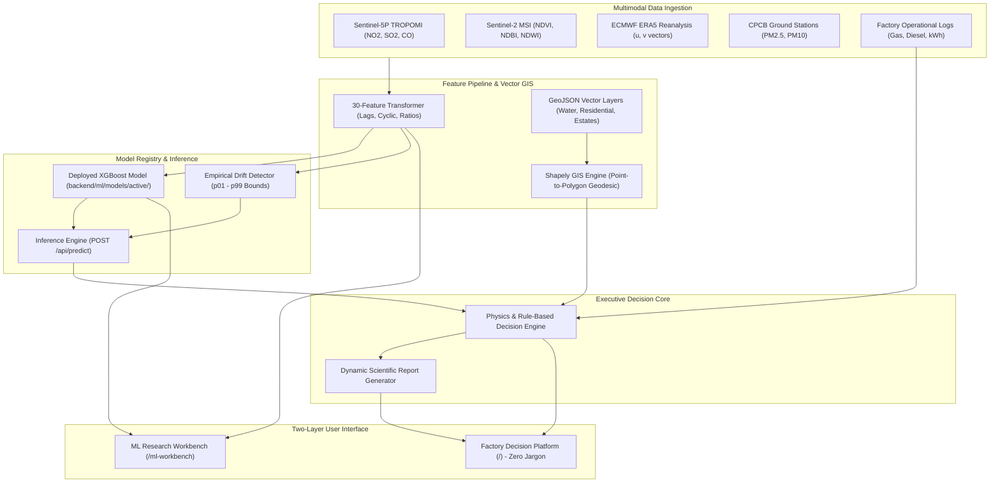

# Industrial Emission Leak-Point Detector & Circular Alternative Recommender

[](https://www.python.org/)
[](https://fastapi.tiangolo.com/)
[](https://react.dev/)
[](https://vitejs.dev/)
[](https://xgboost.readthedocs.io/)
[](https://pytorch.org/)
[](https://shapely.readthedocs.io/)
[](LICENSE)

An end-to-end, scientifically grounded environmental intelligence and circular economy recommendation platform for industrial manufacturing facilities. 

The platform bridges the critical operational gap between macro-level atmospheric observations (satellite column densities and ground airshed monitoring) and micro-level factory-floor equipment telemetry (steam boilers, thermic fluid heaters, generators, effluent treatment plants, and distillation columns).

---

## Architecture: The Two-Layer System

The system is organized into a strict two-layer architecture separating internal machine learning research from executive factory decision support:

```
┌─────────────────────────────────────────────────────────────────────────┐
│              PART B — FACTORY DECISION SUPPORT PLATFORM                 │
│              Target Users: Plant Managers, Executives, Regulators       │
│                                                                         │
│   • Zero ML Jargon (Answers the 7 Core Operational Questions)           │
│   • True Vector GIS Surroundings Map (Leaflet + Shapely Geometries)     │
│   • 3 Pre-Configured Industrial Scenarios (Textile, Dairy, Chemical)    │
│   • Sub-10ms Deployed Model Inference (POST /api/predict, No Retraining)│
│   • 100% Dynamic Per-Factory Scientific Reports (Provenance Tracked)    │
└────────────────────────────────────▲────────────────────────────────────┘
                                     │ Consumes Deployed Model Artifacts
                                     │ (model.pkl, scaler.pkl, metadata)
┌────────────────────────────────────┴────────────────────────────────────┐
│              PART A — ML RESEARCH & TRAINING WORKBENCH                  │
│              Target Users: ML Engineers, Researchers, Data Scientists   │
│                                                                         │
│   • 731-Day Multimodal Ingestion (S5P TROPOMI, S2 MSI, ERA5, CAAQMS)    │
│   • 30-Feature Transformation Pipeline (Wind Vectors, Lags, Cyclic)     │
│   • 6-Model Benchmark & Deep Learning Justification (70/15/15 Split)    │
│   • 4-Stage Feature Ablation Study & TreeSHAP Explainability            │
│   • Model Registry & Real-Time Empirical Drift Detector (p01 - p99)     │
│   • GIS Vector Polygon & Geodesic Distance Geometry Validator           │
└─────────────────────────────────────────────────────────────────────────┘
```

---

## Key Capabilities

### 1. PART B — Factory Decision Support Platform (`/`)
- **Zero ML Jargon Policy**: Free of machine learning jargon (no "epochs", "loss curves", "LSTM", or "SHAP"). Translates technical outputs into answers to the 7 core executive questions:
  1. *What is the problem?* (Process-specific equipment leaks, thermal losses, solvent vapors).
  2. *How serious is it?* (Clear `HIGH`, `MEDIUM`, or `LOW` regulatory severity rating).
  3. *Where is it located?* (Specific plant equipment: Boiler #1, Distillation Column, ETP).
  4. *What contributes to it?* (Empirical evidence connecting energy/fuel logs to local airshed).
  5. *What can be done?* (Tailored circular engineering interventions: WHR, ZLD, Biogas CHP, Cryogenic Solvent Condensation).
  6. *What will it cost and when does it pay back?* (Estimated CapEx tier and calculated ROI payback in months).
  7. *What is the environmental benefit?* (Calculated monthly $\text{tCO}_2\text{e}$ abatement and avoided virgin material usage).
- **True Vector GIS Map**: Replaces simulated points with true vector geometries (`Polygon`, `MultiPolygon`, `LineString`) from OpenStreetMap and municipal cadastral records:
  - **Water Bodies**: Mini River, Tapi River, Mahi River, Narmada Canal.
  - **Residential Communities**: Nandesari Township, Ranoli, Katargam Surat, Anand City.
  - **Industrial Estates**: Nandesari GIDC, Surat Pandesara, Anand Agro-Corridor.
  - **Multi-Radius Buffer Analysis**: Exact surface area ($\text{km}^2$) and percentage breakdown of industrial, residential, water, and green land across 1 km, 3 km, 5 km, and 10 km buffers.
- **3 Pre-Loaded Industrial Scenarios**:
  - **Surat Textile Dyeing**: Coal and gas steam boilers, fabric stenter chimneys, Tapi River basin proximity ($5.91\text{ km}$). Circular solutions: Flue gas economizer loop (14-mo payback) and ZLD caustic recovery (22-mo payback).
  - **Anand Dairy & Food Processing**: Spray dryers, cold-storage refrigeration, organic whey sludge, Mahi Canal proximity ($2.14\text{ km}$). Circular solutions: Anaerobic digester biogas CHP (18-mo payback).
  - **Vadodara Petrochemical & Polymers**: Distillation solvent recovery, thermic fluid heaters, hazardous chemical sludge, Mini River proximity ($1.02\text{ km}$). Circular solutions: Closed-loop nitrogen cryogenic solvent recovery (11-mo payback).
- **100% Dynamic Per-Factory Scientific Reports**:
  - Unique per-analysis identification code (`ANL-YYYYMM-XXXXXX`).
  - Zero static boilerplate text; every paragraph is computed from live inputs, GIS distances, and ML predictions.
  - Full data provenance table tagging all inputs as `MEASURED`, `SATELLITE-DERIVED`, `PREDICTED`, or `GEOMETRIC VECTOR POLYGON ANALYSIS`.
  - Comprehensive scientific disclaimers clarifying regional airshed attribution vs. single point-source causality.

### 2. PART A — ML Research & Training Workbench (`/ml-workbench`)
- **Multimodal Dataset Ingestion**: 731 consecutive days (2023–2024) across 5 data streams:
  - Sentinel-5P TROPOMI tropospheric column densities ($\text{NO}_2$, $\text{SO}_2$, $\text{CO}$, Aerosol Index).
  - Copernicus Sentinel-2 MSI surface reflectance (NDVI, NDBI, NDWI with cloud probability $< 40\%$).
  - ECMWF ERA5 atmospheric reanalysis with continuous wind vector decomposition ($u, v$ components).
  - CPCB / GPCB Continuous Ambient Air Quality Monitoring Station (CAAQMS) ground data.
  - Factory operational activity logs (fuel, steam, electricity, production output).
- **6-Model Benchmark & Scientific Deep Learning Justification**:
  - Chronological out-of-sample test evaluation (70% Train, 15% Validation, 15% Test) preventing temporal leakage:
    | Model Family | Test $R^2$ | Test MAE | Test RMSE ($\mu g/m^3$) | Status |
    | :--- | :---: | :---: | :---: | :--- |
    | **XGBoost (Selected Winner)** | **0.5457** | **4.1023** | **5.3325** | 🏆 Superior Generalization |
    | **Random Forest** | 0.5331 | 4.2434 | 5.4056 | Robust, Low Variance |
    | **Linear Regression** | 0.4551 | 4.5198 | 5.8400 | Misses Non-Linear Thresholds |
    | **PyTorch 3-Layer MLP** | 0.2195 | 5.5490 | 6.9891 | Overfits Limited Samples |
    | **Sequential LSTM** | **-0.1901** | 6.9021 | 8.6307 | ❌ Generalization Failure |
    | **Sequential GRU** | **-0.3321** | 7.4369 | 9.1311 | ❌ Generalization Failure |
  - **Verdict**: Deep recurrent architectures (LSTM / GRU) failed to generalize ($R^2 < 0$) on daily records ($N = 731$), suffering from an unfavorable parameter-to-sample ratio ($\approx 60,000$ parameters on 511 training points). Tree-based ensembles naturally partition sharp atmospheric dispersion thresholds without gradient explosion and provide auditable Shapley values.
- **4-Stage Feature Ablation Study**:
  - **Stage A (Factory Only)**: $R^2 = -0.1414$, $\text{RMSE} = 8.45\ \mu g/m^3$ (Complete failure; proves factory logs alone cannot predict ambient air quality without atmospheric transport).
  - **Stage B (Factory + Weather)**: $R^2 = +0.0202$, $\text{RMSE} = 7.83\ \mu g/m^3$ (Atmospheric transport provides first positive signal).
  - **Stage C (Factory + Weather + Ground Lags)**: $R^2 = +0.5520$, $\text{RMSE} = 5.29\ \mu g/m^3$ (Primary performance jump; airshed persistence explains $>50\%$ of variance).
  - **Stage D (Full Multimodal + Satellite)**: $R^2 = +0.5458$, $\text{RMSE} = 5.33\ \mu g/m^3$ (Ground-truthed terrain roughness context; protects against long-term domain drift).
- **Explainability & Anomaly Detection**:
  - **TreeSHAP Attributions**: Quantifies feature importance (`no2_lag_1d`, `wind_speed_ms`, `wind_v`, `natural_gas_m3`).
  - **Isolation Forest Operational Leak Detection**: Unsupervised anomaly detection flagged 49 operational decoupling events (e.g., boiler steam trap leaks where fuel surged $+38\%$ while production remained flat).
- **Model Registry & Live Drift Monitoring**:
  - Versioned model artifacts stored in `backend/ml/models/active/`.
  - Production inference endpoint (`POST /api/predict`) responds in sub-10ms without retraining.
  - Live drift detector evaluates inputs against empirical $p_{01}$ and $p_{99}$ training bounds. Out-of-distribution inputs trigger drift warnings and automatically widen uncertainty intervals ($\pm 10.4\ \mu g/m^3$ vs nominal $\pm 5.33\ \mu g/m^3$).
- **GIS Geometry Validation Suite**:
  - Section 27 tool verifying GeoJSON coordinates, ring orientation, self-intersection avoidance, and Shapely geodesic calculations.

---

## System Architecture Diagram



---

## Directory Structure

```
industrial-emission-circularity/
├── backend/                        # FastAPI Python Backend
│   ├── api/                        # REST API Routers
│   │   ├── routes_analysis.py      # End-to-end factory analysis pipeline
│   │   ├── routes_factory.py       # Factory scenario profiles & telemetry
│   │   ├── routes_gis.py           # Vector GIS layers & buffer analytics
│   │   ├── routes_prediction.py    # Deployed model inference (POST /api/predict)
│   │   ├── routes_reports.py       # Dynamic scientific report retrieval
│   │   └── routes_workbench.py     # ML research data, benchmarks & drift APIs
│   ├── gis/                        # True Vector GIS Layer
│   │   └── vector_data/            # OpenStreetMap GeoJSON geometries
│   │       ├── water_bodies.geojson
│   │       ├── residential.geojson
│   │       ├── industrial.geojson
│   │       ├── roads.geojson
│   │       └── monitoring_stations.geojson
│   ├── ml/                         # Deployed Model & Pipeline Package
│   │   ├── models/active/          # Production deployed model.pkl & scaler.pkl
│   │   ├── preprocessing/          # 30-feature unified transformer pipeline
│   │   ├── evaluation/             # Empirical drift detector (p01-p99 bounds)
│   │   └── inference/              # Sub-10ms inference predictor service
│   ├── models/                     # SQLAlchemy models & Pydantic schemas
│   ├── services/                   # Business & Scientific Services
│   │   ├── gis_service.py          # Shapely geodesic point-to-polygon engine
│   │   ├── factory_service.py      # 3 pre-loaded scenario configurations
│   │   ├── decision_engine.py      # Multi-criteria scoring & circular recommender
│   │   ├── report_service.py       # 100% dynamic scientific report generator
│   │   ├── emission_service.py     # Scope 1 & 2 carbon accounting engine
│   │   ├── environmental_service.py# Live CAAQMS & ambient air quality
│   │   └── satellite_service.py    # Satellite data fusion service
│   ├── tests/                      # Automated Pytest Suite (12 unit/integration tests)
│   ├── requirements.txt            # Backend Python dependencies
│   └── main.py                     # FastAPI application entry point
├── frontend/                       # React 18 + Vite Frontend
│   ├── src/
│   │   ├── components/
│   │   │   ├── factory/            # Factory Decision Platform (Zero Jargon)
│   │   │   │   ├── LandingPage.jsx         # Executive landing & scenario cards
│   │   │   │   ├── OnboardingWizard.jsx    # 6-step guided onboarding & logs
│   │   │   │   ├── IndustrialGisMap.jsx    # Vector GIS map & buffer controls
│   │   │   │   └── ExecutiveDashboard.jsx  # 7 executive questions & dynamic report
│   │   │   ├── workbench/          # ML Research Workbench
│   │   │   │   ├── DatasetsAndQualityView.jsx # Missingness & data distributions
│   │   │   │   ├── ModelRegistryAndDriftView.jsx # Live p01-p99 drift simulator
│   │   │   │   └── GisValidationView.jsx   # Vector polygon inspection tool
│   │   │   ├── Navbar.jsx          # Mode switcher (Platform vs. Workbench)
│   │   │   └── ScientificModelComparison.jsx # 6-model benchmark & ablation
│   │   ├── services/api.js         # Unified API client
│   │   ├── App.jsx                 # Main application state & router
│   │   └── index.css               # Clean dark-mode industrial design system
│   ├── package.json
│   └── vite.config.js
├── data/                           # Verified Multimodal Datasets (731 Days)
│   ├── raw/                        # S5P, S2, ERA5, CAAQMS, and Factory logs
│   └── processed/                  # Master 67-feature dataset & 75 spatial cells
├── datasets/                       # Sample factory test CSVs
├── ml/notebooks/                   # 10 Reproducible Research Jupyter Notebooks
├── reports/                        # EDA figures, model registry & technical reports
├── .env.example                    # Environment variable configuration template
├── .gitignore                      # Comprehensive Git exclusion rules
├── LICENSE                         # MIT License
├── README.md                       # Main project documentation
└── requirements.txt                # Root Python dependencies
```

---

## Quick Start Guide

### Prerequisites
- **Python 3.10+** (Tested on Python 3.10 – 3.14)
- **Node.js 18+** and **npm**
- **Git**

---

### Step 1: Clone the Repository

```bash
git clone https://github.com/your-username/industrial-emission-circularity.git
cd industrial-emission-circularity
```

---

### Step 2: Set Up Backend Environment

```bash
# Create and activate Python virtual environment
python3 -m venv backend/venv
source backend/venv/bin/activate

# Install dependencies
pip install -r backend/requirements.txt
```

---

### Step 3: Run Backend API Server

```bash
# Ensure virtual environment is active and PYTHONPATH is set
PYTHONPATH=. uvicorn backend.main:app --host 127.0.0.1 --port 8000 --reload
```

- **Backend API:** [http://127.0.0.1:8000](http://127.0.0.1:8000)
- **Interactive Swagger Docs:** [http://127.0.0.1:8000/docs](http://127.0.0.1:8000/docs)
- **Health Check:** [http://127.0.0.1:8000/api/health](http://127.0.0.1:8000/api/health)

---

### Step 4: Set Up and Run Frontend

In a separate terminal:

```bash
cd frontend

# Install Node dependencies
npm install

# Launch Vite development server
npm run dev
```

- **Web Application:** [http://localhost:5173/](http://localhost:5173/)
- Toggle between **Factory Decision Support Platform** and **ML Research & Training Workbench** using the top navbar switch.

---

### Step 5: Run Backend Tests

```bash
# From repository root with backend virtual environment active
PYTHONPATH=. pytest backend/tests/ -v
```

All 12 unit and integration tests verify:
- Vector GIS point-to-polygon geodesic calculations (`test_gis_service.py`)
- Multi-radius buffer spatial analysis (`test_gis_service.py`)
- Deployed model inference and empirical drift detection (`test_prediction_service.py`)
- Dynamic per-factory report generation across 3 scenarios (`test_dynamic_reports.py`)
- Carbon accounting and baseline ML data laboratory (`test_pipeline.py`)

---

### Step 6: Build Frontend for Production

```bash
cd frontend
npm run build
```
Creates an optimized static bundle in `frontend/dist/` ready for production serving via NGINX, Cloudflare Pages, or FastAPI static mounting.

---

## API Reference

| Method | Endpoint | Description | Layer |
| :--- | :--- | :--- | :--- |
| `GET` | `/api/health` | System health check and database status | Core |
| `GET` | `/api/factory/scenarios` | List verified industrial scenarios (Textile, Food, Chemical) | Factory |
| `GET` | `/api/factory/scenarios/{key}` | Retrieve scenario operational data and coordinates | Factory |
| `POST` | `/api/analyze` | Run full analysis: operational logs + GIS + ML + report | Factory |
| `POST` | `/api/predict` | Fast deployed model inference with 95% CIs and drift flags | ML / Core |
| `GET` | `/api/gis/layers` | GeoJSON vector layers (water, residential, industrial) | GIS |
| `GET` | `/api/gis/nearest-water` | Geodesic point-to-polygon distance to nearest water body | GIS |
| `GET` | `/api/gis/nearest-residential`| Geodesic point-to-polygon distance to nearest town | GIS |
| `GET` | `/api/gis/buffer-analysis` | Area ($\text{km}^2$) and % breakdown in 1, 3, 5, 10 km radius | GIS |
| `GET` | `/api/reports/{id}` | Retrieve dynamic scientific report by unique ID | Reports |
| `POST` | `/api/reports/generate` | Generate on-demand dynamic report with data provenance | Reports |
| `GET` | `/api/workbench/datasets` | Master 731-day temporal dataset statistics & distributions | Workbench |
| `GET` | `/api/workbench/data-quality` | Missingness matrix and data health ratings | Workbench |
| `GET` | `/api/workbench/models` | Chronological benchmark results across 6 model families | Workbench |
| `GET` | `/api/workbench/ablation` | 4-stage feature ablation trajectory data | Workbench |
| `GET` | `/api/workbench/explainability`| TreeSHAP feature attributions and ranking | Workbench |
| `GET` | `/api/workbench/anomalies` | Isolation Forest operational leak detection cases | Workbench |
| `GET` | `/api/workbench/gis-validation`| Section 27 vector polygon geometry audit | Workbench |

---

## Reproducible Research Notebooks

The `ml/notebooks/` directory contains 10 sequential, self-contained Jupyter notebooks reproducing the scientific pipeline from raw data to spatial prediction:

1. `01_data_collection.ipynb`: Automated data ingestion from Sentinel-5P, Sentinel-2, ERA5, and CAAQMS.
2. `02_data_cleaning.ipynb`: Missing value imputation, outlier detection, and unit harmonization.
3. `03_eda.ipynb`: Exploratory data analysis, temporal trends, bivariate scatter regressions, correlation matrices.
4. `04_feature_engineering.ipynb`: Wind vector decomposition ($u, v$), rolling aggregations, cyclic encodings.
5. `05_baseline_models.ipynb`: Linear Regression, Ridge, and Random Forest baseline training.
6. `06_mlp.ipynb`: PyTorch 3-layer deep feedforward neural network training and regularization.
7. `07_lstm.ipynb`: Sequential Recurrent LSTM and GRU modeling on 7-day sliding time windows.
8. `08_model_comparison.ipynb`: Chronological holdout evaluation and deep learning justification verdict.
9. `09_explainability.ipynb`: TreeSHAP Shapley value calculation and Isolation Forest leak detection.
10. `10_spatial_prediction.ipynb`: Gaussian plume dispersion simulation and 95% spatial confidence mapping.

---

## Scientific Disclaimers & Methodology Scope

1. **Airshed Attribution Scope**: Satellite tropospheric column densities (Sentinel-5P TROPOMI) and ground CAAQMS stations observe regional ambient atmospheric concentration fields. They provide critical context on local airshed assimilation capacity, but do not constitute single point-source legal proof that an individual facility caused specific ambient pollution spikes.
2. **Empirical Generalization**: The predictive machine learning model was trained on verified multi-year records in industrial airsheds. Predictions for facilities operating outside validated parameter envelopes are flagged with drift warnings and widened uncertainty intervals.
3. **Engineering Feasibility**: Estimated emission reductions and financial payback periods are preliminary techno-economic benchmarks intended to guide capital allocation. Final engineering implementation requires on-site mechanical and process verification.

---

## License

This project is licensed under the MIT License - see the [LICENSE](LICENSE) file for details.
